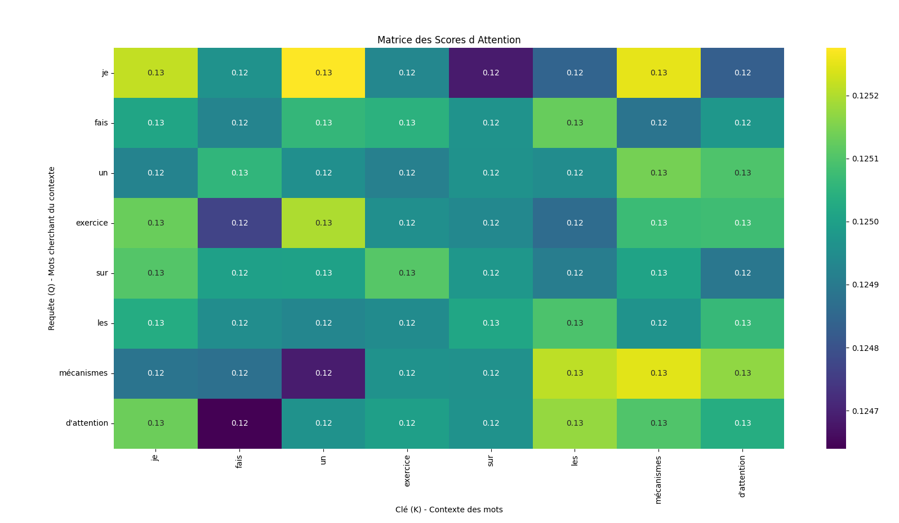
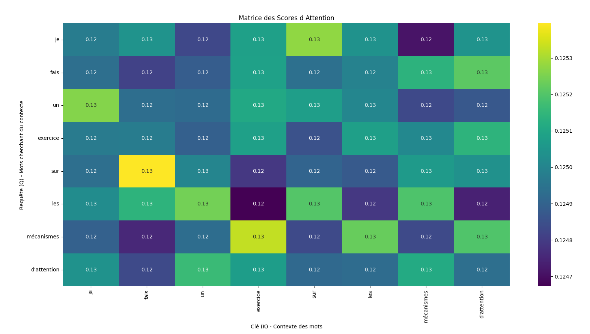
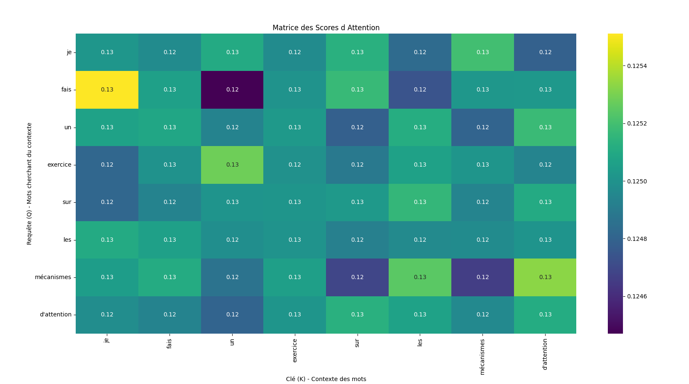
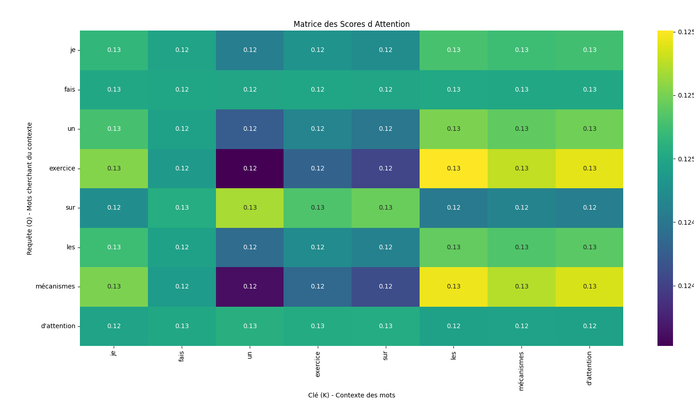

# Exercice : Attention mechanisms

### 1. Configuration de l'environnement
```bash
python -m venv gen-ai
.\gen-ai\Scripts\activate 
pip install -r requirements.txt
```

### 2. Exécution du projet
```bash
python main.py
```

## Explication du Self-Attention
Le self-attention est une technique qui permet aux modèles d'apprendre quelles parties d'une phrase sont importantes pour le contexte global. Il fonctionne en calculant trois vecteurs pour chaque mot :

- **Requête (Query, Q)** : Ce que le mot cherche à comprendre.
- **Clé (Key, K)** : Ce que le mot représente dans le contexte.
- **Valeur (Value, V)** : L'information originale du mot.

Le mécanisme compare chaque requête (Q) avec toutes les clés (K) pour obtenir un score d'attention, qui est ensuite utilisé pour pondérer les valeurs (V). Cela permet à chaque mot de capter l'information pertinente d'autres mots dans la phrase.

## Importance des Poids d'Attention
Les poids d'attention permettent d'identifier quelles parties d'une phrase sont mises en avant par le modèle. 

## Expérimentation : Tester Différents Nombres de Têtes d'Attention
Nous testons ici plusieurs valeurs pour le nombre de têtes d'attention `[2, 8, 20, 50]` afin d'observer leur impact sur l'analyse contextuelle.

Pour rappel les poids d'attention permettent d'identifier quelles parties de la phrase sont mises en avant par le modèle. Nous avons testé avec **différents nombres de têtes d'attention** et voici les résultats obtenus :

**Avec 2 têtes** 



**Avec 8 têtes** 


**Avec 20 têtes** 
Certaines connexions apparaissent plus fortes entre certains mots



**Avec 50 têtes** 

On commence à voir des liens entre les mots comme mécanisme/d'attention ou les/mécanismes


