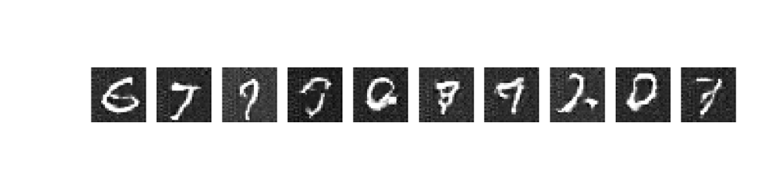
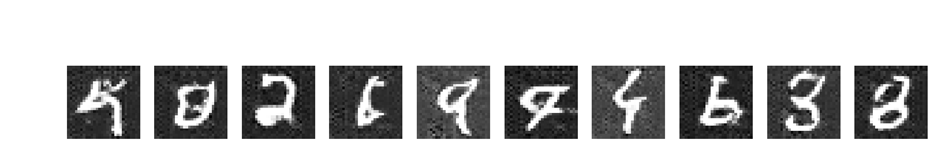

# Lab 2: Advanced Generative Adversarial Networks (GANs) 

## Configuration de l'environnement

```bash
python -m venv gen-ai
.\gen-ai\Scripts\activate 
pip install -r requirements.txt
```

---

## Part 1: CNN-based GAN

### Exécution du modèle

Pour exécuter le modèle basé sur CNN, utilisez la commande suivante :

```bash
python main.py --model cnn
```

### Principe des GANs

Un Generative Adversarial Network (GAN) est un modèle génératif composé de deux réseaux neuronaux :

- **Le générateur** : Produit des images à partir de bruit aléatoire (espace latent)
- **Le discriminateur** : Distingue les images réelles des fausses.

Ces réseaux s'entraînent en compétition (adversarial) :
- Le générateur tente de tromper le discriminateur en produisant des images réalistes.
- Le discriminateur apprend à identifier les fausses images.

### CNN et Convolution

Un **CNN (Convolutional Neural Network)** est un réseau de neurones conçu pour l'analyse et le processing d'images.

La **convolution** est une opération mathématique utilisée pour extraire des caractéristiques d'une image (bords, textures, motifs). Elle consiste à appliquer un filtre qui va effectuer des multiplications et des additions sur les valeurs de l'image d'entrée pour produire une version transformée (généralement plus petite).

L'application de plusieurs filtres permet au CNN d'extraire progressivement des caractéristiques de haut niveau des images.

Dan les GAN les CNN sont utilisés pour leur capacité à :

- **Le générateur** : Utilisé la Conv2DTranspose pour transformer un bruit aléatoire en une image (Inverse de la convolution)
- **Le discriminateur** : Utiliser la convolution pour extraire les caractéristiques des images pour apprendre à différencier les images vraies des faussses.

### Détails des couches

**Sequential** 

Une architecture où les couches sont empilées linéairement et est adapté pour des transformations ordonnées et des connexions simples.
Chaque couche va prendre l'entrée de la couche précédente et génèrera une sortie pour la couche suivante.

**Couche Dense** 

Prend en entrée un vecteur de données, dans ce Lab ce sera le vecteur de bruit aléatoire. (7 * 7 * 256) représente la taille de la sortie de 
la couche Dense. Ainsi la couche Dense va transformer le vecteur de bruit aléatoire de dimension (input_dim) en un vecteur de taille 7 * 7 * 256.
Cette couche permet de convertir le vecteur de bruit en une nouvelle forme qui peut être utilisée par les couches suivantes du réseau.
Son but est de projeter le vecteur de bruit aléatoire dans un espace plus structuré. C'est une étape intermédiaire avant de générer l'image finale.

### Fonction d'activation

Une activation est une fonction appliquée à la sortie d'un neurone pour introduire de la non-linéarité dans un réseau de neurones ce qui est essentiel pour apprendre les relations complexes et que le réseau ne soit pas seulement une combinaison linéaire de ses rentrée. Voici les différentes fonction d'activation utilisée dans ce Lab : 

***ReLU*** (max(0,x)) est utilisée pour introduire de la non-linéarité dans le modèle, il est simple et rapide à calculer.

***tanh*** transforme les valeurs en un intervalle [-1, 1] centré autour de zéro, ce qui est utile pour normaliser les images générées. Cela correspond à l'échelle de normalisation des images MNIST.

***LeakyReLU*** (f(x) = x si x > 0 sinon alpha*x) est une variante de l'activation ReLU (qui lui met à zéro toutes les valeurs négatives (neurones morts) et peut empêcher un apprentissage efficace).
LeakyReLU permet aux valeurs négatives d'avoir une pente (alpha=0.2) et donc leur permet un petit gradient pour les valeurs négatives

***Sigmoid*** transforme la sortie entre [0,1], ce qui est idéal pour un problème de classification binaire.
Cela donne une probabilité indiquant si l'image est réelle ou générée.

### Les convolutions

***Conv2D*** est une couche de convolution qui applique des filtres pour extraire des caractéristiques de l'image d'entrée. Voici les paramètres utilisés : 

- `64` : nombre de filtres utilisés dans cette couche. Chaque filtre apprend à détecter un motif spécifique.
- `kernel_size=4` : taille de chaque filtre (4x4 pixels).
- `strides=2` : décalage de 2 pixels pour chaque application du filtre, ce qui permet de réduire la taille de l'image de moitié.
- `padding="same"` : ajoute du padding pour conserver la taille de l'image après convolution.
- `input_shape=(28, 28, 1)` : forme de l'image d'entrée (28x28 pixels, 1 canal pour les images en niveaux de gris).

La couche Conv2D renvoie une nouvelle image transformée où chaque pixel est une combinaison linéaire des pixels de l'image d'entrée, pondérée par les filtres.
Après cette opération de convolution, on applique généralement une fonction d'activation pour introduire de la non-linéarité.
Sans cela, chaque couche du réseau effectuerait une transformation linéaire des données et cela limiterait donc la capacité du réseau à mieux capturer les relations complexes dans les données.


### 1. What is Transpose Convolution and why do we use it Generator?

La **Conv2DTranspose** permet la **déconvolution**, une opération qui agrandit progressivement l'image en ajoutant des détails.
Elle inverse la convolution pour augmenter la taille de l'image tout en ajoutant des informations pour rendre l'image plus réaliste et utilise des filtres pour reconstruire des structures réalistes à partir des données projetées par les couches précédentes.

Dans un GAN, cette opération permet au générateur de transformer un bruit aléatoire en une image réaliste. Par exemple, une image initiale de taille `(7, 7, 256)` peut être agrandie jusqu'à `(28, 28, 1)` pour une image en niveaux de gris (en corrélation avec les dimensions des images MNIST). Voici les paramètres utilisés :

- `kernel_size=4` : Définit la taille du filtre pour apprendre les motifs.
- `strides=2` : Double la taille de l'image en largeur et hauteur.
- `padding="same"` : Maintient la taille de sortie identique à celle de l'entrée.

### 2. What are LeakyReLU and sigmoid and why do we use them?

- **LeakyReLU** : Variante de la fonction d'activation ReLU qui permet un faible gradient pour les valeurs négatives. Contrairement à ReLU qui annule toutes les valeurs négatives, LeakyReLU applique une pente (alpha=0.2), évitant ainsi l'arrêt de l'apprentissage pour certaines valeurs et donc les neurones mortes.

- **Sigmoid** : Fonction d'activation qui transforme une valeur en un score entre [0,1], utilisé pour les problèmes de classification binaire, comme dans le discriminateur qui doit décider si une image est réelle ou générée.

---

## Part 2: Transformer-based GAN

### Transformers 

Un **Transformer-based GAN** est une variante des GAN qui utilise des **mécanismes d'attention** inspirés des Transformers.

### Le mécanisme d'attention

L'attention est une technique qui permet à un réseau neuronal de **se concentrer sur les parties les plus importantes** des données d'entrée.

- L'entrée est divisée en plusieurs sous-espaces appelés "têtes" d'attention.
- Chaque tête calcule des poids pour chaque paire d'éléments d'entrée, déterminant leur importance relative.
- Ces poids sont ensuite utilisés pour créer une représentation pondérée des éléments d'entrée, mettant en avant les plus significatifs.

### Les Transformers

Les **Transformers** sont une architecture de réseau neuronal qui traite les données en parallèle, améliorant ainsi l'efficacité du traitement.

- Ils sont capables de capturer les relations à longue distance entre les éléments d'une séquence.
- Ils sont particulièrement efficaces pour des tâches comme la traduction automatique et la génération de texte.

### Transformers appliqués aux GANs

Dans un **Transformer-based GAN**, les mécanismes d'attention permettent d'améliorer la génération d'images en identifiant les **parties cruciales** de l'image pendant la génération.
Contrairement aux **CNN** qui exploitent des convolutions pour extraire les caractéristiques locales, les **Transformers** capturent les **relations globales** entre les pixels grâce à l'attention.

Ce modèle est particulièrement puissant pour générer des images complexes où les dépendances spatiales sont importantes.


--- 

## Résultats

### CNN Gan

Les chiffres sont assez nets mais certains sont peu lisibles et mal définis. La qualité des traits reste conforme aux chiffres MNIST. Il manque de diversités



### Transformers-based GAN

Certains chiffres sont bien formés et d'autres un peu plus tordus voir flous. Il est un peu plus flou et on peut remarqué l'apparition de bruits et certains traits sont mal formés. La structure globale reste cependant lisible et il y a une meilleure diversité. 



Ainsi le Gan CNN est efficace et permet de capturer les structures locales mais peut être moins diversifié et produire des chiffres flous. Cela peut être ajuster en ajoutant peut-être davantage de dimensions, mettre un dropout pour éviter le surapprentissage et permettre de la diversité. Le GAN transformer produit des chiffres plus variés et lisibles mais cela reste encore un peu flou. On pourrait peut-être mettre plus de têtes d'attentions et améliorer le discriminateur.
