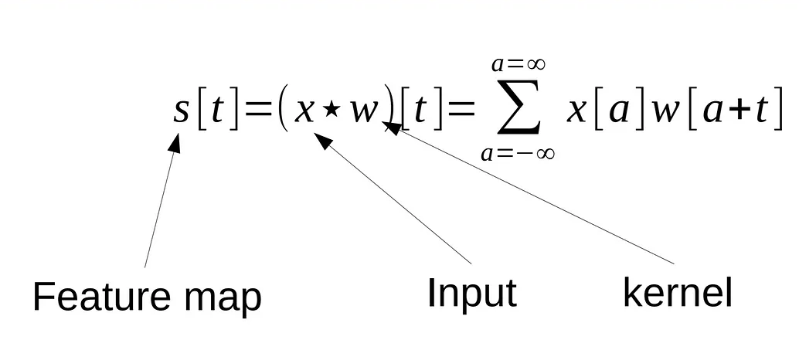
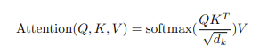

# Lab 2: Advanced Generative Adversarial Networks (GANs) 

## Configuration de l'environnement

```bash
python -m venv gen-ai
.\gen-ai\Scripts\activate 
pip install -r requirements.txt
```

---

## Part 1: CNN-based GAN

### Exécution du modèle

Pour exécuter le modèle basé sur CNN, utilisez la commande suivante :

```bash
python main.py --model cnn
```

## Part 1: Theoretical Overview 

### Transformers 

### Le self-attention mechanism

L'attention est une technique qui permet à un réseau neuronal de **se concentrer sur les parties les plus importantes** des données d'entrée. Il permet de se concentrer sur des parties de la séquence d'entrée pendant que le modèle essaye de prédire la séquence de sortie. 

Le self-attention va relier différentes positions d'une même séquence d'entrée pour calculer une représentation de la séquence et donc créer des connexions similaires.

Le calcul d'attention peut se faire avec une requête (Query) et d'un set de clé-valeurs (K,V) 
Le but de la self attention est de calculer des "scores d'attention" qui reflètent à quel point une donnée a une importance par rapport à une autre. 

- L'entrée est divisée en plusieurs sous-espaces appelés "têtes" d'attention.
- Chaque tête calcule des poids pour chaque paire d'éléments d'entrée, déterminant leur importance relative.
- Ces poids sont ensuite utilisés pour créer une représentation pondérée des éléments d'entrée, mettant en avant les plus significatifs.

Ce mécanisme permet une parallélisation beaucoup plus importante.

### Positional encoding

Du fait de la parallisation, le positional encoding devient nécessaire. Le transformer traite chaque donnée comme un point indépendant des autres. 
Le positional encoding est une méthode dans les transformers permettant d'ajouter une notion d'ordre lors du traitement des données (textes ou images). Il va décrire la position d'une entité dans une séquence. En effet, dans un transformer les données sont souvent traitées en parallèle, il est de ce fait important de connaitre l'ordre des mots (si on parle d'une phrase) pour comprendre les dépendances.

Il existe différents types de Positional Encoding. 

- Absolute Positional Encoding

Cette méthode a gagné en popularité à travers le papier "Attention Is All You Need” by Vaswani et al. Cette méthode est basé sur une position sinusoidale.

Cette méthode génère en premier un vecteur unique pour chaque position dans la séquence en utilisant une combinaison de sinus et cosinus. Le vecteur d'encoding possède la même dimension que le token d'embedding pour qu'ils puissent être ajoutés facilement.

- Rotary Position Embedding

Une autre méthode RoPE (Rotary Position Embedding) introduit dans le papier “RoFormer: Enhanced Transformer with Rotary Position Embedding" décide appliqué une rotation géométriqueaux vecteurs d'embeddings en fonction de leur position dans la séquence. C'est une fonction prenant en entrée la position du token d'embeddings. Au lieu d'ajouter séparémment les positional encoding, le RoPE fait pivoter la requête et la clé en se basant sur leur position dans la séquence. De cette manière les scores d'attention dépendent sur comment les mots sont loin des autres et pas de leur position absolue (prendre en compte que not est à côté de happy). L'information sur la distance des tokens sera donc conservée même si la séquence entière est déplacée ou allongée.

Pour les phrases :

- "Not happy." -> relation entre not et happy sera capturée de manière relative (RoPE) mais de manière absolue (1,2) pour l'attention

- "The teacher is not happy today." -> relation entre not et happy sera inchangée (RoPE) mais sera recalculée sur leurs nouvelles positions (3,4)

De ce fait avec RoPE les relations entre deux mots seront toujours interprétée de manière stable et flexibles même si la phrase change ce qui permet de généraliser plus facilement. L'attention classique lui devient sensible aux déplacements car il base son encodage sur une position absolu. Ce dernier sera donc très efficace sur des phrases courtes mais moins sur des phrases longues.

Contrairement aux méthodes fixes, le learnable positional encoding apparu dans un papier "A Simple yet Effective Learnable Positional Encoding Method for
Improving Document Transformer Model" a pour but d'apprendre directement les encodages positionnels pendant l'entrainement du modèle. Ainsi, chaque position dans la séquence possède un vecteur d'encodage appris par le modèle. Cela permet d'apprendre les représentations spécifiques 


### Relation entre convolution et attention

La convolution applique un filtre à une entrée pour extraire les caractéristiques locales. Pour ce faire il applique un filtre W à une entrée X (séquence de mots ou pixel d'image). 



En pratique, pour un CNN nous utilisons des fenêtres de convolution finies k car chaque images et séquences ont une taille fini et donc le filtre de convolution doit avoir une taille définie. Chaque élement de sortie est donc une somme pondérée des éléments voisins de l'entrée. Donc ici seuls les voisins proches vont influencer le calcul.

L'attention lui permet à chaque élement d'une séquence de se connecter directement à tous les autres éléments. Pour ce faire, l'attention est définie par un dot product entre une matrice de valeurs associés aux clés et une softmax. Tous les tokens sont comparés entre eux à travers le produit scalaire QK^T qui est une matrice de similarité entre tous les tokens (chacun peut influencer les autres). Le softmax convertit cela en probabilité normalisées pour donner plus de poids aux tokens pertinent.



Ici on fait la somme sur tous les élements de la séquences donc ils sont tous connectés entre eux car la sortie dépend de tous les éléments v et les poids sont calculés dynamiquement et varient selon le contexte. Donc ici, chaque élément a accès à toute la séquence ce qui permet d'avoir des relations plus globales.

Ainsi, dans l'attention chaque élement de la sortie est une combinaison pondéré des valeurs où les poids d'attentions sont définis par un softmax.

Si on restreint l'attention à ses voisins on obtient une convolution car elle sera restreinte à ses voisins. 

### L'orthonormalité 

L'orthonormalité (orthogonalité et norme unitaire -> Vecteurs perpendiculaires et norme 1) joue un rôle important. En CNN on impose que les filtres convolutifs soient orthogonaux ce qui permet de garantir que chaque filtre apprend une caractéristique unique et indépendante. Si les filtres sont similaires les caractéristiques apprises seront redondantes et l'apprentissage plus lent.


### Token [CLS] (Classify Token) : Comment on réussit à classer et pourquoi ?

Les modèles comme Bert on été entrainé sur 2 tâches : 

- Masked language modeling : Certains mots sont aléatoirement masqués avec un [MASK] token. Le modèle apprend à prédire ces mots 

- Next sentence prediction qui à partir de 2 phrases, le modèle apprends à prédire si la 2 ème phrase est vrai. Pour ce faire on aura besoin d'un autre token [CLS] permettant de savoir quelle est la séquence préférable.

Le CLS est un token de classification ajouté en début d'une séquence de texte avant d'être traité par le modèle BERT. Contrairement aux autres tokens [CLS] est neutre au départ et n'est jamais masqué donc il accumule les informations sur tous les autres. 
Il a pour but de capturer l'ensemble du contexte de la phrase. Après passage dans BERT, le vecteur associé à CLS contient une représentation globale de la séquence. [CLS] synthétise l’information de tous les tokens (ou patches d’image) via l’attention.

A travers les couches sa représentation changera à chaque étape, le CLS est mis à jour par le mécanisme d'attention.
On essaye de faire une régression logistique avec les éléments qui sont des éléments d'images. Le CLS permet d'avoir une indication d'importance à une classe.
-- 