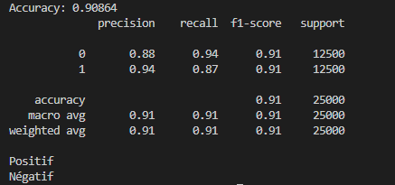
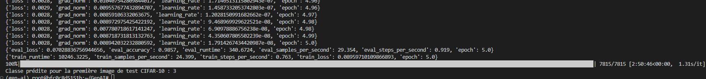
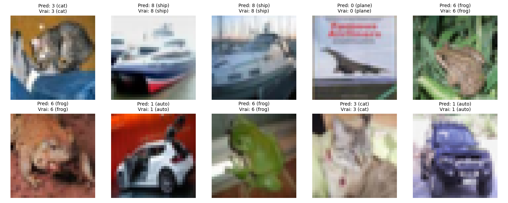

# Lab: Exploring Transformers for Natural Language Processing and Vision Tasks

## Configuration de l'environnement

```bash
python -m venv gen-ai
.\gen-ai\Scripts\activate 
pip install -r requirements.txt
```

---
## Part 1: Theoretical Overview 

### Le self-attention mechanism

L'attention est une technique qui permet à un réseau neuronal de **se concentrer sur les parties les plus importantes** des données d'entrée. Il permet de se concentrer sur des parties de la séquence d'entrée pendant que le modèle essaye de prédire la séquence de sortie. 

Le self-attention va relier différentes positions d'une même séquence d'entrée pour calculer une représentation de la séquence et donc créer des connexions similaires.

Le calcul d'attention peut se faire avec une requête (Query) et d'un set de clé-valeurs (K,V) 
Le but de la self attention est de calculer des "scores d'attention" qui reflètent à quel point une donnée a une importance par rapport à une autre. 

- L'entrée est divisée en plusieurs sous-espaces appelés "têtes" d'attention.
- Chaque tête calcule des poids pour chaque paire d'éléments d'entrée, déterminant leur importance relative.
- Ces poids sont ensuite utilisés pour créer une représentation pondérée des éléments d'entrée, mettant en avant les plus significatifs.

Ce mécanisme permet une parallélisation beaucoup plus importante.

### Positional encoding

Du fait de la parallisation, le positional encoding devient nécessaire. Le transformer traite chaque donnée comme un point indépendant des autres. 
Le positional encoding est une méthode dans les transformers permettant d'ajouter une notion d'ordre lors du traitement des données (textes ou images). Il va décrire la position d'une entité dans une séquence. En effet, dans un transformer les données sont souvent traitées en parallèle, il est de ce fait important de connaitre l'ordre des mots (si on parle d'une phrase) pour comprendre les dépendances.

Il existe différents types de Positional Encoding. 

- Absolute Positional Encoding

Cette méthode a gagné en popularité à travers le papier "Attention Is All You Need” by Vaswani et al. Cette méthode est basé sur une position sinusoidale.

Cette méthode génère en premier un vecteur unique pour chaque position dans la séquence en utilisant une combinaison de sinus et cosinus. Le vecteur d'encoding possède la même dimension que le token d'embedding pour qu'ils puissent être ajoutés facilement.

- Rotary Position Embedding

Une autre méthode RoPE (Rotary Position Embedding) introduit dans le papier “RoFormer: Enhanced Transformer with Rotary Position Embedding" décide appliqué une rotation géométriqueaux vecteurs d'embeddings en fonction de leur position dans la séquence. C'est une fonction prenant en entrée la position du token d'embeddings. Au lieu d'ajouter séparémment les positional encoding, le RoPE fait pivoter la requête et la clé en se basant sur leur position dans la séquence. De cette manière les scores d'attention dépendent sur comment les mots sont loin des autres et pas de leur position absolue (prendre en compte que not est à côté de happy). L'information sur la distance des tokens sera donc conservée même si la séquence entière est déplacée ou allongée.

Pour les phrases :

- "Not happy." -> relation entre not et happy sera capturée de manière relative (RoPE) mais de manière absolue (1,2) pour l'attention

- "The teacher is not happy today." -> relation entre not et happy sera inchangée (RoPE) mais sera recalculée sur leurs nouvelles positions (3,4)

De ce fait avec RoPE les relations entre deux mots seront toujours interprétée de manière stable et flexibles même si la phrase change ce qui permet de généraliser plus facilement. L'attention classique lui devient sensible aux déplacements car il base son encodage sur une position absolu. Ce dernier sera donc très efficace sur des phrases courtes mais moins sur des phrases longues.

Contrairement aux méthodes fixes, le learnable positional encoding apparu dans un papier "A Simple yet Effective Learnable Positional Encoding Method for
Improving Document Transformer Model" a pour but d'apprendre directement les encodages positionnels pendant l'entrainement du modèle. Ainsi, chaque position dans la séquence possède un vecteur d'encodage appris par le modèle. Cela permet d'apprendre les représentations spécifiques 


### Relation entre convolution et attention

La convolution applique un filtre à une entrée pour extraire les caractéristiques locales. Pour ce faire il applique un filtre W à une entrée X (séquence de mots ou pixel d'image). 


En pratique, pour un CNN nous utilisons des fenêtres de convolution finies k car chaque images et séquences ont une taille fini et donc le filtre de convolution doit avoir une taille définie. Chaque élement de sortie est donc une somme pondérée des éléments voisins de l'entrée. Donc ici seuls les voisins proches vont influencer le calcul.

L'attention lui permet à chaque élement d'une séquence de se connecter directement à tous les autres éléments. Pour ce faire, l'attention est définie par un dot product entre une matrice de valeurs associés aux clés et une softmax. Tous les tokens sont comparés entre eux à travers le produit scalaire QK^T qui est une matrice de similarité entre tous les tokens (chacun peut influencer les autres). Le softmax convertit cela en probabilité normalisées pour donner plus de poids aux tokens pertinent.


Ici on fait la somme sur tous les élements de la séquences donc ils sont tous connectés entre eux car la sortie dépend de tous les éléments v et les poids sont calculés dynamiquement et varient selon le contexte. Donc ici, chaque élément a accès à toute la séquence ce qui permet d'avoir des relations plus globales.

Ainsi, dans l'attention chaque élement de la sortie est une combinaison pondéré des valeurs où les poids d'attentions sont définis par un softmax.

Si on restreint l'attention à ses voisins on obtient une convolution car elle sera restreinte à ses voisins. 


### Feedforward layer

Dans un réseau de neurones une couche feedforward est une couche entièrement connectée où chaque neurone est connecté à tous les neurones de la couche suivante. Son but est d'effectuer une transformation linéaire suivi d'une activation non-linéaire.

Dans un transformer, chaque couche est suivi d'une couche feedforward qui a pour but d'appliquer des transformations supplémentaires aux représentations des tokens. En effet, le self-attention se contente uniquement d'ajuster l'importance des mots entre eux mais ne transforme pas vraiment les informations. C'est pour cela que la couche feedforward permet de capturer les interactions complexes entre les tokens qui ne peuvent pas être remarqué par le self-attention.

S'il n'y avait pas de couche feed-forward, le self attention serait simplement entrain de refaire une moyenne des valeurs des vecteurs. Donc pour ajouter plus de non-linéarité aux vecteurs on ajoute une couche feed forward à la partie encoder du transformer.
Si on avait des bloc de self-attention sans feedforward ils agiraient tous de la même manière. En les ajoutant ces derniers leurs permet d'agir comme des modèles séparés qui peuvent être entrainé. En effet, les couches feedforward fonctionne séparément pour chaque mot, de cette façon chaque mot est transformé sans interagir avec les autres. -Le modèle devient comme une pile de modèle où chaque modèle récupère des poids différents. Ainsi, cela rend cette partie facilement parallélisable du modèle. 

La couche feedforward agit comme une mémoire où chaque clé correspond à un pattern de mots dans le set de training et chaque valeur permet de prédire le prochain mot en fonction de ce pattern.

### BERT (Bidirectional Encoder Representations from Transformers) for NLP.

Bert est un modèle de type Transformers introduit dans un papier en 2018 par la filière d'intelligence artificielle de Google (Google AI) conçu pour le NLP.

C'est un LLM entrainé sur un grand corpus de données textuelles et conçu pour générer du texte en langage naturel. Contrairement à ses prédecesseurs, Bert utilise une approche bidirectionnel du langage afin de prendre en compte à la fois les mots précédents mais aussi les mots suivant dans une phrase afin d'avoir une meilleur compréhension sur le contexte de la phrase.

Comme tout modèle de type transformer, à chaque étape est appliqué un mécanisme d'attention pour comprendre la relation entre les mots de la phrase qu'importe leurs positions. 
Ce dernier utilise un empilement de couches d'encodeurs. Il est composé d'un système de tokenisation pour découper une séquence de texte en tokens, puis d'un mécanisme de self-attention pour regarder comment chaque mots s'influencent entre eux et d'évaluer l'importance de ces derniers dans le contexte. Il y a donc plusieurs couches d'encodeurs et chacun d'entres elles possède deux sous-couche, une d'auto attention et une autre de feedforward pour un apprentissage plus complexes de la séquence. Pour introduire une notion d'ordre on fait appel au positional encoding qui s'ajoute aux embeddings de mots pour donner cette information positionnelle.

Durant la phase d'entrainement, me modèle est entrainé de manière non supervisée sur deux tâche : 

- Une nouvelle technique appelée le Masked LM (MLM) consistant à masquer aléatoirement des mots dans la phrase puis d'essayer de les prédire. Cela signifie que le modèle regarde dans les deux sens et qu'il utilise le contexte complet de la phrase (gauche et droite) pour prédire le mot masqué.

- Le Next Sentence Prediction qui a pour objectif de faire prédire au modèle la séquence de mots suivant pour qu'il comprenne la continuité entre les phrases consécutives. 

Après cette phase le modèle est fine-tuné sur des tâches spécifiques grâce à des couches supplémentaires pour permettre d'adapter Bert (RoBERTa, CamemBert ...)

### Vision Transformers (ViT) for images.

Dans la computer vision (détection d'objet, reconnaissance d'images ..) plusieurs technologies ont émergé comme les CNN ou la VIT.

Les CNN sont très efficaces pour traiter des images leur permettant d'extraire les caractéristiques importantes. Cependant, un des défauts majeurs des CNN est que les couches de convolutions se concentrent sur des petites zones à la fois et perdent donc une partie de l'information en négligeant les relations spatiales entres les composantes d'une même image.

Les Vision Transformer (ViT) ont été développé pour contrer cela. Un ViT est une architecture de réseau neuronal pour le traitement de données inspiré des transformer. Ces derniers utilisent un mécanisme d'attention qui leur permet de prendre en compte l'ensemble de l'image d'un coup plutôt que de traiter des parties de manière isolées.

L'une des plus grande difficulté était l'application des mécanisme d'attention entre les différents pixels de chaque image ce qui serait très long et couteux en calcul. Grâce au ViT, cela devient possible en coupant l'image en patchs afin d'accélérer les calculs et optimiser le temps d'exécution. 

Ainsi chaque patch va être transformé en vecteur qui sera introduit dans une couche de projection linéaire pour créer des vecteurs appelés patch embedding. Les positions embeddings seront ajoutés à ces vecteurs pour connaître leurs positions dans l'image initiale ce qui est essentiel pour bien analyser les relations spaciales. Sans cette partie le réseau ne peut pas connaitre l'ordre de la séquence et donc ne pourra pas reproduire la même représentation pour deux patchs identiques situés à deux endroits différents dans une image. 
Cette séquence de vecteur est ensuite introduite dans l'encodeur pour calculer l'attention entre les différentes images. La sortie de ce dernier est ensuite envoyer dans une couche qui aura pour but de classifier.

### L'orthonormalité 

L'orthonormalité (orthogonalité et norme unitaire -> Vecteurs perpendiculaires et norme 1) joue un rôle important. En CNN on impose que les filtres convolutifs soient orthogonaux ce qui permet de garantir que chaque filtre apprend une caractéristique unique et indépendante. Si les filtres sont similaires les caractéristiques apprises seront redondantes et l'apprentissage plus lent.


### Token [CLS] (Classify Token) : Comment on réussit à classer et pourquoi ?

Les modèles comme Bert on été entrainé sur 2 tâches : 

- Masked language modeling : Certains mots sont aléatoirement masqués avec un [MASK] token. Le modèle apprend à prédire ces mots 

- Next sentence prediction qui à partir de 2 phrases, le modèle apprends à prédire si la 2 ème phrase est vrai. Pour ce faire on aura besoin d'un autre token [CLS] permettant de savoir quelle est la séquence préférable.

Le CLS est un token de classification ajouté en début d'une séquence de texte avant d'être traité par le modèle BERT. Contrairement aux autres tokens [CLS] est neutre au départ et n'est jamais masqué donc il accumule les informations sur tous les autres. 
Il a pour but de capturer l'ensemble du contexte de la phrase. Après passage dans BERT, le vecteur associé à CLS contient une représentation globale de la séquence. [CLS] synthétise l’information de tous les tokens (ou patches d’image) via l’attention.

A travers les couches sa représentation changera à chaque étape, le CLS est mis à jour par le mécanisme d'attention.
On essaye de faire une régression logistique avec les éléments qui sont des éléments d'images. Le CLS permet d'avoir une indication d'importance à une classe.

## Bert Résultat 



## Cifar 



Visualisation des prédictions : 



## Part 4: Reflection and Discussion (30 minutes)
Discussion Points:

### 1. What are the differences in how Transformers process text versus images?

Pour le texte les transformers traitent une séquence de token auxquels on ajoutes les embeddings positionnels pour l'ordre alors que pour les images on découpe en premier en patchs puis on transforme ces dernier en vecteurs avec des embeddings pour prendre en compte l'ordre également.

### 2. How does the self-attention mechanism adapt to different data modalities?

Le mécanisme d'attention reste le même dans le sens ou il compare les représentation de chaque token avec tous les autres. Cependant, avec le texte il va chercher les relations syntaxiques ou sémantiques entre les mots alors qu'avec les images, ce sont les patchs qui vont s'auto attentionner pour capturer les détails et le global. Les embeddings de position permettent d'optimiser cela.

### 3. What are the limitations of Transformers, and how can they be mitigated?

Les transformers nécessitent de grandes capacités de calculs car elles regardent les relations entre les tokens ce qui peut être long et prendre du temps. De plus on a besoin de beaucoup de données pour avoir un apprentissage optimal. 

Pour essayer de contrer cela on peut utiliser des variantes d'attention ou des méthodes de distillation ou compression.